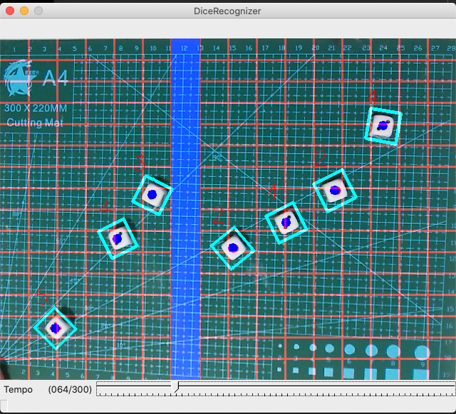

### Dice Sequencer
With the help of OpenCV Dice Sequencer is an interactive way of sequencing musical instruments 
through physical objects. This is very much proof of concept and work in progress. 
Still need to improve dice face detection and figure what to do with dice face information.
Maybe introduce more randomness to the sequence. Currently obtained information x/y axis and dice face number of each dices.
Maybe this can be more than a simple sequencer. Objective is yet undecided and lots to explore.

## Requirement 
Tested on Python 3
All libraries are included in the `venv`.  
`cd to project folder`  
then  
`source venv/bin/activate`  
activate it before running it  

then `python3 diceDetect.py` to run    

## Dependencies 
Main dependencies are python-rtmidi and cv2

## Stuff sill need to add
- Note quantization
- Better Dice face detection
- More featured sequencer
- Alternative sequencing modes
- Dice face affecting certain parameters (undecided- maybe gate length or jumping effect)

